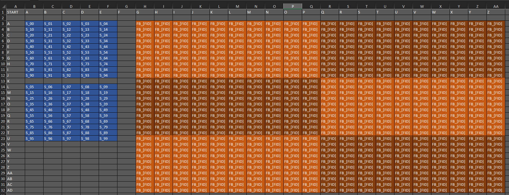
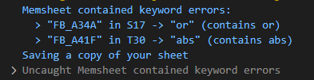
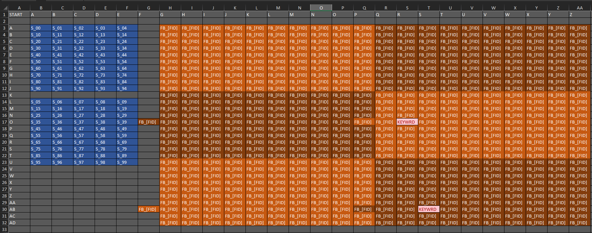

# Yimp-example

This is a quick example to copy in order to get set up with yimp

## Steps taken to create this repo
---
- create a repo (obviously)
- get & setup Yimp:
    ```bat
    git submodule add https://github.com/Azurethi/Yimp
    cd Yimp
    setup
    ```
- create ``index.js`` and import Yimp:
    ```js
    const YIMP = require('./Yimp/src/YIMP');
    ```
- (if you're using vscode) create a vscode launch json for ``index.js`` (see in ``.vscode`` folder)

That's you set up! You can now ask Yimp to compile (and paste) your projects.

But to do that we actually need a project... I'll create a simple screen renderer for a 10x10 text pannel screen in the ``rendering_system`` folder.

## Creating the rendering system

- create a memory map in excel (``memory map.xlsx``):
    - 100 vars for the screens (shown in blue)
    - 600 vars for the frame buffer (orange) one var per screen line:
    
- create a blank ``renderer.yasm`` (will fill in later)
- create a system definition file (``system.js``)
  - create a "renderer yolol" section
  - add a yolol chip definition which pulls in ``renderer.yasm`` & ``memory map.xlsx``
- modify our main ``index.js``, get yimp to watch for changes & compile as we develop
    ```js
    YIMP.watch([__dirname, "rendering_system"], "renderer yolol");
    ```
- run ``index.js``
    - Yimp will complain as we've tried to allocate global variables with yolol keywords in them:
    
    
    As noted, it saves a modified copy of our map, but it loses our pretty colours. Since it's just ``S17`` & ``T30``, I'll remove them manually like so:
    

- run ``index.js``
    - you should now see a build folder in ``rendering_system``, this will contain two subfolders ``yolol``, which contains any compiled yasm & ``deriv`` which contains all of the final chip code for your system (for if you feel like checking everything).
    - if you leave ``index.js`` running, it will watch for changes in your yasm & rebuild the system when it finds any. This allows you to split your editor with your yasm & one of your deriv files to watch out for the yolol limits.

- develop the system!
    - Write yasm for the renderer chips that will concatenate the frame buffer into each device field (see ``renderer.yasm``), as if only doing the first chip
    - Add rules to the system def which tell yimp how to modify this code for each of the 100 total chips (see ``system.js``) **NB: you'll need to reload yimp to see the effects of changes in this file**
    - give lutReplacers a definition for a "FID" function, to fill in the more complicated device field names in the memory map (see ``system.js``)
    - (optional) add extra sections to paste in device fields
        - ``frame buffer``: for pasting the frame buffer fields into memory chips
        - ``screens``: to rename all 100 screen fields
